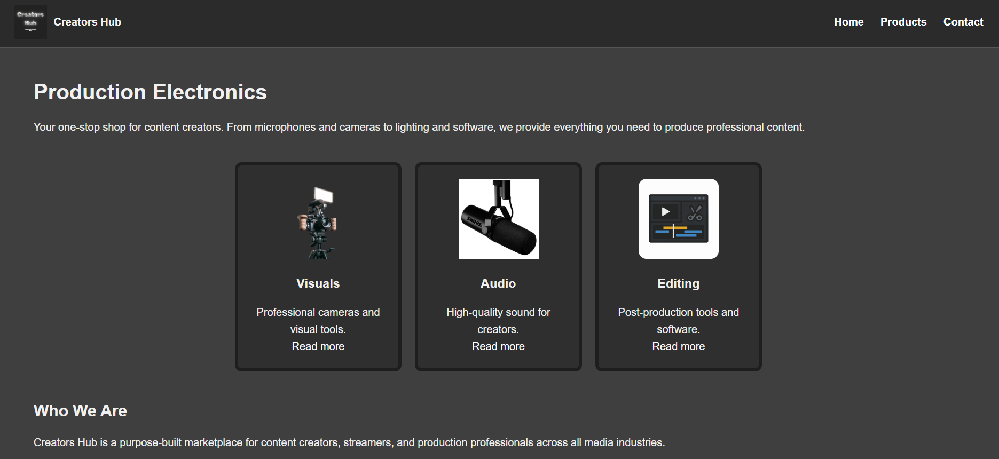

# E-Commerce Website (HTML & CSS)

## Project Overview
This project is a static e-commerce website created using HTML5 and CSS3.
It demonstrates page structure, navigation, layout, and responsive design.
No JavaScript was used.

## Website Pages
- Home page
- Products page
- Contact page

## Technologies Used
- HTML5
- CSS3
- GitHub Pages

## Live Website
https://username.github.io/Browne/

## Screenshots

## Author
Thomas Browne – CST0400 – 2025/26
